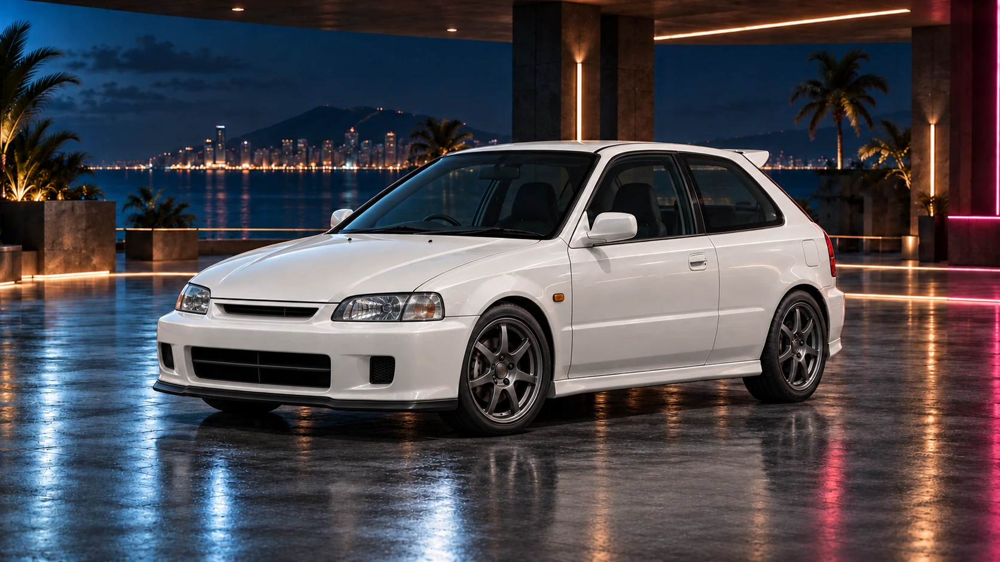

<div align="center">

# SOLARA CITY

**Build the business. Own the streets. Take the city.**

A coastal crime-empire idle / tycoon game about street hustles, neon nights and building something that lasts.

<a href="https://tlsnipz.github.io/Idle-Game/">
  
</a>

**[Play in your browser](https://tlsnipz.github.io/Idle-Game/)** · [What's in the game](#in-the-game-today) · [What's next](#whats-next) · [Developer guide](#development)


[](https://github.com/TLSnipZ/Idle-Game/actions/workflows/deploy-pages.yml)

<a href="https://tlsnipz.github.io/Idle-Game/">
  
</a>

*The Kairo KX-R — approved vehicle artwork used in the game, not a gameplay screenshot.*

**Single-player · Browser-first · No account required**

</div>

---

## Start small. Build an empire.

Your first operation is a waterfront detailing business. Your next move might be a quiet cash front, a performance workshop, or a nightclub on Neon Mile.

Run deliveries for immediate Cash, build passive income, recruit specialists and decide when to reinvest. Manage Heat, make choices in City Events, and eventually **Rebirth**: trade the current run for permanent Empire Points and a stronger comeback.

**HUSTLE → BUILD → EXPAND → REBIRTH → REBUILD STRONGER**

Open **Operations** to make your first deliveries and acquire **Dockside Detail**. From there, the Business ladder grows with you:

**Dockside Detail → Neon Laundry → Afterdark Customs → Solara Nights**

## In the game today

| System | What you can do |
| --- | --- |
| **Business empire** | Acquire four distinct Businesses, develop each through Level 100, and grow their combined passive production. Progression gates make later acquisitions depend on developing the earlier operation. |
| **Equipment & automation** | Buy production and delivery upgrades, hire a **Delivery Dispatcher**, and enable a **Business Auto-Upgrader** for one selected owned Business. Automatic upgrade spending is opt-in. |
| **City & crew** | Start in **Waterfront**, take control of **Neon Mile**, and recruit **Rico Vale, Mara Knox and Jax Mercer**. Assign specialists to Operations or Logistics to activate their effects. |
| **Heat & City Events** | Manage rising Heat and use Lay Low. **Hot Tip, Shakedown and Warehouse Opportunity** offer two clearly explained choices each during online play. |
| **Rebirth & Empire Points** | Reset temporary run progress for Empire Points. Invest in **five permanent ranked skills** and keep your purchased vehicle through Rebirth. |
| **Garage** | Purchase the **Kairo KX-R**, the first canonical Solara vehicle, with its own approved artwork and a permanent ownership bonus. |
| **Achievements & statistics** | Unlock **six permanent achievements** and track **eight lifetime statistics** across runs. These record progress without adding gameplay bonuses. |
| **Next Objective** | Follow a suggested progression step with exact Level/Cash requirements, or choose an optional goal. Jump to the relevant card from any section; guidance never purchases or resets anything. |
| **Offline progress & backups** | Return to credited Business and Dispatcher earnings for up to **8 hours**, extendable to **12 hours** through Never Sleeps. Save locally and transfer progress with **CE1 export/import codes**. |

The interface has five sections: **Overview** for your dashboard, **Operations** for earning and automation, **City** for territories, Heat, crew and events, **Collection** for the Garage, and **Empire** for Rebirth, skills, milestones and save transfer. Operations also has **Jobs / Businesses / Automation** jump navigation. **Next Objective** is shared across all five sections; its optional goal selection is not saved. See [Guidance](docs/GUIDANCE.md) for its suggested-route policy.

## Your first permanent garage investment

**Kairo KX-R** is Solara's lightweight, 1990s-inspired performance hatch. Build the Business portfolio now; keep the car when you start your next run.

| Purchase | Requirements | Ownership bonus |
| --- | --- | --- |
| **$25,000** | Player Level 5 · Dockside Detail Level 5 | **+10% global Business Production**, including offline and after Rebirth |

The current game has **one purchasable vehicle**. Additional models, an Active Vehicle system and tuning are planned — not hidden features waiting to be unlocked. The [vehicle catalog](docs/VEHICLE_CATALOG.md) separates the implemented KX-R from future concepts.

## Development status

**Playable development build — still growing, not a finished release.**

This build includes the Base Game foundation and **POST 3D: Business Progression Gates & Shared Requirement Polish**, followed by a **safe New Game / Reset Progress** flow and **Next Objective / Guidance**. Current saves use **schema v17**; portable backups retain the **CE1** format. Supported older saves migrate through the existing sequential migration chain.

The [Base Game roadmap](docs/ROADMAP.md) records the original development phases. [Post-roadmap priorities](docs/POST_ROADMAP.md) track subsequent expansions and the next planned work. Implementation status and browser/live acceptance are recorded separately; a completed code milestone is not a claim that every device has been visually tested.

## What's next?

These are **planned directions, not features in the current build**. Scope and order may evolve as the game is tested.

| Direction | Planned additions |
| --- | --- |
| **A clearer, more comfortable game** | Settings, English/German localization and continued accessibility polish. |
| **Global HUD & activity** | A compact sticky HUD, a more usable activity feed and easier access to City Events from anywhere in the interface. |
| **A stronger Solara identity** | Final logo and favicon, followed by controlled Business artwork batches and richer city presentation. |
| **A growing Garage** | Active Vehicle selection, the remaining Tier-1 cars and, later, per-vehicle tuning and additional catalog tiers. |
| **A deeper city** | Heat/Police expansion, more Business depth, crew and event development, and richer territory progression. |

The longer-term vision connects Businesses, cars, crew and city control through rival factions, Operations, Heists and Territory takeovers. New content should strengthen existing systems rather than become an isolated menu.

See [current priorities](docs/POST_ROADMAP.md), the [Business expansion design](docs/BUSINESS_EXPANSION.md) and the [vehicle catalog](docs/VEHICLE_CATALOG.md) for the detailed plans.

## Keep your progress safe

Progress is stored **locally in your browser**. There are **no cloud saves or account synchronization**. Clearing site data, changing browser or moving to another device does not carry your save with you automatically.

Before clearing browser data or switching devices, use **Empire → Save & Transfer → Export save** and keep a copy of the `CE1-` code. Import validates the code and asks for confirmation before replacing current progress.

<details>
<summary><strong>Save, offline and import details</strong></summary>

- The game saves after supported successful actions and periodically every five seconds. Watch for storage errors; do not assume a failed save was stored.
- Business production and the Delivery Dispatcher use the same capped offline interval. An enabled Auto-Upgrader can spend Cash on its selected owned Business during that interval.
- City Events do **not** advance or spawn offline. A pending event is retained through normal save/load and export/import.
- Importing an old code does not award income or XP from its historical timestamp. Offline timing starts from the new local import timestamp.
- Corrupt or unsupported newer saves are preserved rather than silently replaced. Read the in-game warning before confirming any replacement.
- CE1 codes are portable backup data, **not encrypted secrets**. They should not be treated as account credentials.

Rebirth is **not** a full New Game reset: it keeps the permanent progression listed in the in-game review. Always read the Keep/Lose summary before confirming.

For a complete restart, open **Empire → Save & Transfer → New Game / Reset Progress**. Export and copy a backup first. Review the warning, type `RESET`, and explicitly confirm. This erases **all run and permanent progress**, including vehicles, EP, skills, achievements and statistics, without awarding EP. The new game is published only after saving succeeds; corrupt, newer or conflicting saves are not silently overwritten. See the [New Game safety contract](docs/RESET_PROGRESS.md).

</details>

## Development

Built with **React, strict TypeScript, Vite, Vitest and modern CSS**. Gameplay rules are separated from rendering, with exact Money arithmetic, deterministic elapsed-time simulation, versioned saves and sequential migrations. The browser build is client-side; no backend or account service is required.

Use **Node.js 24**, as pinned in [`.nvmrc`](.nvmrc). The package requires Node.js 22.12 or newer.

```sh
git clone https://github.com/TLSnipZ/Idle-Game.git
cd Idle-Game
npm ci
npm run dev
```

### Checks and production preview

```sh
npm run typecheck
npm run test
npm run build
npm run preview
```

`build` includes the TypeScript check and emits the static application to `dist/`. Automated coverage includes economy rules, purchase failures, save migrations, CE1, offline chronology, automation, Rebirth and UI interactions. Browser, keyboard and responsive reviews complement those tests; they are not interchangeable.

<details>
<summary><strong>Project structure</strong></summary>

```text
src/
  app/        Application composition, sections and navigation
  features/   Feature configuration, domain rules and presentation
  game/       Shared state contracts and cross-feature integration
  platform/   Browser clock, storage and runtime adapters
  shared/     Reusable UI and utilities
  assets/     Approved reference artwork and production assets
  styles/     Global styles and presentation tokens
docs/         Architecture, balance, art direction and roadmaps
.github/
  workflows/  GitHub Pages build and deployment
```

</details>

<details>
<summary><strong>GitHub Pages deployment</strong></summary>

The existing [Deploy to GitHub Pages workflow](.github/workflows/deploy-pages.yml) runs on pushes to `main` and can also be started manually from Actions. It installs dependencies, runs the checked production build and deploys **only `dist/`**.

For this repository, **Settings → Pages → Build and deployment → Source** must be **GitHub Actions**. The application uses Vite's relative base so built assets resolve beneath `/Idle-Game/`.

The deployment badge above reports the workflow status. It is not a live gameplay or accessibility certification.

</details>

## Project documentation

| Document | Purpose |
| --- | --- |
| [Development rules](AGENTS.md) | Scope, conventions, architecture boundaries and safe handoffs. |
| [Architecture](docs/ARCHITECTURE.md) | Domain/UI separation, runtime, state, persistence and migrations. |
| [Current balance](docs/BALANCING.md) | Implemented prices, requirements, effects and formulas. |
| [Business expansion](docs/BUSINESS_EXPANSION.md) | The four-Business economy, model assumptions and progression rationale. |
| [Vehicle catalog](docs/VEHICLE_CATALOG.md) | Implemented vehicle identity and future Garage planning. |
| [Art direction](docs/ART_DIRECTION.md) | Solara's visual language and approved reference-asset workflow. |
| [Base Game roadmap](docs/ROADMAP.md) | Original phase history, kept separate from expansion priorities. |
| [Post-roadmap priorities](docs/POST_ROADMAP.md) | Current expansion status, next steps and deferred systems. |
| [Release audit](docs/BASE_GAME_RELEASE.md) | Base Game verification evidence and review limitations. |

Found something broken? [Open an issue](https://github.com/TLSnipZ/Idle-Game/issues) with the steps to reproduce, your browser/device and a screenshot when useful. Avoid posting backup codes publicly unless you intend to share your saved progress.

---

<div align="center">

**Your empire starts at the waterfront.**

### [PLAY SOLARA CITY →](https://tlsnipz.github.io/Idle-Game/)

</div>
